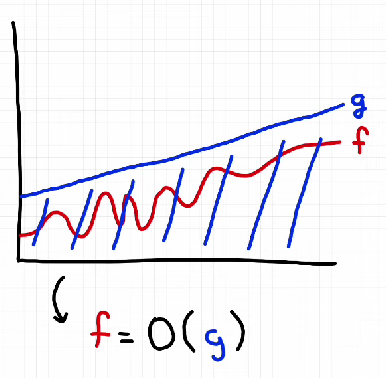

<h1 align="center"> Data-Structures-and-Algorithmns</h1>

# Data structures

## 1. Arrays

Arrays are a collection of items stored at contiguous memory locations.

*Advantages:*

1. Easy to implement: Arrays are simple to implement and use.
2. Fast access: Elements can be accessed quickly using their index. - O(1) time complexity.
3. Easy to append: Adding elements at the end is straightforward. - O(1) time complexity on average.

*Disadvantages:*

1. Inefficient insertions/deletions: Adding or removing elements can be slow, as it may require shifting elements. - O(n) time complexity.

*Usage:*

1. Traverse a structure in order.
2. Acess specific elements quickly through indexing.
3. Compare elements from both ends of the array.
4. Sliding window problems.

## 2. Strings

Strings are a sequence of characters, often used to represent text.

*Advantages:*

1. Appendable: Strings can be easily concatenated or appended to form new strings.
2. Easy to manipulate: Many built-in functions are available for string manipulation, such as slicing, searching, and replacing.
3. Readable: Strings are human-readable and can be easily understood and modified.

*Disadvantages:*

1. Immutable: Strings cannot be changed after creation, which can lead to inefficiencies when modifying them.
2. Modifying strings can be costly: Since strings are immutable, any modification creates a new string, which can be inefficient in terms of both time and space.

*Usage:*

1. Find longest substring without repeating characters.
2. Check if 2 strings are anagrams.
3. Return all substrings that match a given pattern.

## 3. Sets

Sets are a collection of unique items, often used to store non-repeating elements. It hashes elements then when during searching it again do hash and after that it goes to the index of that hash.

*Advantages:*

1. Fast membership testing: Sets provide O(1) average time complexity for membership tests (checking if an element is in the set).
2. Unique elements: Sets automatically handle duplicates, ensuring all elements are unique.
3. Mathematical set operations: Sets support operations like union, intersection, and difference.

*Disadvantages:*

1. Unordered: Sets do not maintain any specific order of elements.
2. Higher memory usage: Sets may use more memory than lists or arrays due to the overhead of hashing.

*Usage:*

1. Remove duplicates from a collection.
2. Check for membership in a collection.
3. Perform mathematical set operations.

## 5. Hash Maps

Hash maps are a data structure that stores key-value pairs, allowing for fast retrieval of values based on their keys. They use a hash function to compute an index into an array of buckets or slots, from which the desired value can be found.

*Advantages:*

1. Fast access: Hash maps provide O(1) average time complexity for lookups, insertions, and deletions.
2. Flexible keys: Keys can be of any immutable type, allowing for a wide range of applications.
3. Efficient memory usage: Hash maps can be more memory-efficient than other data structures like trees or linked lists.
   
*Disadvantages:*

1. Collision handling: When two keys hash to the same index, it can lead to collisions, which can degrade performance.
2. Unordered: Hash maps do not maintain the order of elements.
3. Memory overhead: Hash maps may use more memory than other data structures due to the need for storing keys and values, as well as handling collisions.

*Usage:*

1. Implementing caches (e.g., LRU cache).
2. Counting occurrences of elements (e.g., word frequency).
3. Grouping anagrams or similar items.

## 6. Linked Lists

Linked lists are a linear data structure where elements are stored in nodes, and each node points to the next node in the sequence. This allows for efficient insertion and deletion of elements.

*Advantages*

1. Dynamic size: Linked lists can easily grow and shrink in size by adding or removing nodes.
2. Efficient insertions/deletions: Inserting or deleting elements does not require shifting other elements, as in arrays.
3. No pre-allocation: Linked lists do not require a fixed size, allowing for more efficient memory usage.

*Disadvantages*

1. Memory overhead: Each node requires additional memory for storing a pointer to the next node.
2. Sequential access: Linked lists do not support random access, making it slower to access elements by index.
3. Cache locality: Linked lists may have poor cache performance due to their non-contiguous memory allocation.

*Usage:*

1. Implementing stacks and queues.
2. Maintaining a list of items with frequent insertions/deletions.

## 7. Trees

Trees are hierarchical data structures consisting of nodes connected by edges. Each tree has a root node, and every node can have zero or more child nodes.

*Advantages*
1. Hierarchical structure: Trees naturally represent hierarchical relationships, making them ideal for certain applications.
2. Efficient searching: Balanced trees (e.g., AVL trees, Red-Black trees) provide O(log n) search time.
3. In-order traversal: Trees can be traversed in a way that retrieves elements in sorted order.

*Disadvantages*
1. Complexity: Implementing and maintaining balanced trees can be complex.
2. Memory usage: Trees may require more memory than simpler data structures due to the overhead of storing pointers.

*Usage:*

1. Traversing from top to bottom (e.g., level-order traversal).
2. Looking for closest match to the node (root).
3. Representing hierarchical relationships (e.g., file systems, organization charts).
4. Implementing search trees (e.g., binary search trees, AVL trees).

## 8. Graphs

Graphs are a collection of nodes (or vertices) connected by edges. They can be used to represent various real-world systems, such as social networks, transportation systems, and communication networks.

*Advantages:*

1. Versatile representation: Graphs can represent a wide range of relationships and structures.
2. Efficient traversal: Graph algorithms (e.g., BFS, DFS) can quickly explore large networks.
3. Pathfinding: Graphs can be used to find the shortest path between nodes (e.g., Dijkstra's algorithm).

*Disadvantages:*

1. Complexity: Graph algorithms can be more complex to implement and understand than simpler data structures.
2. Memory usage: Graphs can require more memory to store edges and nodes, especially for dense graphs.
3. Performance: Some graph algorithms may have high time complexity, making them unsuitable for large graphs.

*Usage:*

1. Representing networks (e.g., social networks, transportation networks).
2. Structure can contain cycles or duplicates paths.
3. Exploring possible states.
4. Solving optimization problems (e.g., shortest path, minimum spanning tree).
5. Modeling relationships between entities (e.g., web pages, citations).

---

Note: Rule of thumb
- Input ~ 10^4: use O(n^2) algorithms or less.
- Input ~ 10^5: use O(n log n) algorithms or less.

---

# Algorithms

Algorithms are step by step proccedure to complete a given task.

The efficiency of and algorithm is calculated by its time complexity and space complexity.

1. Time Complexity: It is the measure of time taken by an algorithm to run as a function of the length of the input.
2. Space Complexity: It is the measure of the amount of working storage an algorithm needs.

Big O Notation is used to represent time and space complexity.

Ideally their is a specific function f(n) that describes the time or space requirements in terms of the input size n. We use Big O notation to simplify this function by focusing on the term that grows the fastest as n increases and ignoring constant factors.

Common Time Complexities:

| Complexity | n=10 | n=100 | n=1,000 | n=10,000 | n=100,000 | n=1,000,000 |
|------------|-------|--------|---------|----------|-----------|-------------|
| O(1)       | 1     | 1      | 1       |        | 1        | 1         | 1           |
| O(log n)   | 3     | 7      | 10      | 14       | 17        | 20          |
| O(n)       | 10    | 100    | 1000    | 1,000    | 10,000    | 100,000     |
| O(n log n) | 33    | 664    | 9,966   | 139,000  | 1,660,000 | 20,000,000  |
| O(n^2)     | 100   | 10*3   | 10*6   | 10*8     | 10*10     | 10*12       |
| O(n^3)     | 1,0*3 | 1,0*6  | 1,0*9  | 1,0*12   | 1,0*15    | 1,0*18      |
| O(2^n)     | 1,024 | 1.27*10^30 | - | - | - | - |
| O(n!)     | 3,628,800 | - | - | - | - | - |

#  Algorithms are written in respective folders

---

# 🚀 Interview Preparation Structure

This repository is organized by **patterns commonly asked in top tech companies** for systematic interview preparation.

## 📊 **Folder Organization by Interview Frequency**

| Pattern | Folder | Interview Frequency | Difficulty | Common Usage |
|---------|---------|-------------------|------------|---------------|
| **Arrays & Hashing** | `01_arrays_and_hashing/` | 95% | ⭐⭐⭐ | All Companies |
| **Two Pointers** | `02_two_pointers/` | 80% | ⭐⭐⭐ | Top Companies |
| **Sliding Window** | `03_sliding_window/` | 75% | ⭐⭐⭐ | All Companies |
| **Stack & Queue** | `04_stack_and_queue/` | 70% | ⭐⭐ | Top Companies |
| **Binary Search** | `05_binary_search/` | 65% | ⭐⭐⭐ | Top Companies |
| **Linked Lists** | `06_linked_lists/` | 60% | ⭐⭐ | All Companies |
| **Trees** | `07_trees/` | 85% | ⭐⭐⭐ | All Companies |
| **Tries** | `08_tries/` | 40% | ⭐⭐ | Top Companies |
| **Heap/Priority Queue** | `09_heap_priority_queue/` | 55% | ⭐⭐⭐ | All Companies |
| **Backtracking** | `10_backtracking/` | 50% | ⭐⭐⭐ | Top Companies |
| **Graphs** | `11_graphs/` | 70% | ⭐⭐⭐ | All Companies |
| **Advanced Graphs** | `12_advanced_graphs/` | 30% | ⭐⭐⭐⭐ | Top Companies |
| **Dynamic Programming** | `13_dynamic_programming/` | 60% | ⭐⭐⭐⭐ | All Companies |
| **Greedy** | `14_greedy/` | 45% | ⭐⭐⭐ | Top Companies |
| **Intervals** | `15_intervals/` | 40% | ⭐⭐ | All Companies |
| **Math & Geometry** | `16_math_and_geometry/` | 25% | ⭐⭐ | Top Companies |
| **Bit Manipulation** | `17_bit_manipulation/` | 35% | ⭐⭐ | Top Companies |

## 🎯 **Study Path**

### **Phase 1: Foundation (Weeks 1-4)**
Focus on core patterns that appear in 80% of interviews:
1. Arrays & Hashing → Two Sum, Group Anagrams
2. Two Pointers → 3Sum, Container With Water
3. Sliding Window → Longest Substring problems
4. Stack & Queue → Valid Parentheses, Next Greater Element

### **Phase 2: Intermediate (Weeks 5-8)**
5. Binary Search → Rotated array problems
6. Linked Lists → Reverse, Merge, Cycle detection
7. Trees → Traversals, LCA, BST validation
8. Tries → Word search, Auto-complete

### **Phase 3: Advanced (Weeks 9-12)**
9. Heap/Priority Queue → Top K problems
10. Backtracking → N-Queens, Word Search
11. Graphs → BFS, DFS, Connected components
12. Advanced Graphs → Shortest path, MST

### **Phase 4: Expert (Weeks 13-16)**
13. Dynamic Programming → LIS, Edit Distance, Knapsack
14. Greedy → Interval scheduling, Jump game
15. Intervals → Merge intervals, Meeting rooms
16. Math & Geometry → Matrix problems
17. Bit Manipulation → XOR tricks, Subsets

## 💡 **How to Use This Structure**
- Each folder contains patterns and problems commonly asked across tech companies
- Start with high-frequency patterns first
- Practice 2-3 problems daily from current pattern
- Move to next pattern only after mastering current one

---

# DSA Patterns Checklist

### **Phase 1: Foundation (Weeks 1-4)**
- [ ] **01. Arrays & Hashing** (95% frequency)
  - [ ] Two Sum variants mastered
  - [ ] Hash map optimization techniques learned
  - [ ] Frequency counting patterns practiced
  - [ ] Completed 15+ problems
  
- [ ] **02. Two Pointers** (80% frequency)
  - [ ] Opposite direction pointers mastered
  - [ ] Same direction pointers practiced
  - [ ] 3Sum/4Sum problems solved
  - [ ] Completed 12+ problems

- [ ] **03. Sliding Window** (75% frequency)
  - [ ] Fixed size window problems solved
  - [ ] Variable size window patterns mastered
  - [ ] Substring optimization techniques learned
  - [ ] Completed 10+ problems

- [ ] **04. Stack & Queue** (70% frequency)
  - [ ] Basic stack operations mastered
  - [ ] Monotonic stack patterns learned
  - [ ] Queue and deque usage practiced
  - [ ] Completed 8+ problems

### **Phase 2: Intermediate (Weeks 5-8)**
- [ ] **05. Binary Search** (65% frequency)
  - [ ] Classic binary search template mastered
  - [ ] Search in rotated arrays solved
  - [ ] Binary search on answer practiced
  - [ ] Completed 10+ problems

- [ ] **06. Linked Lists** (60% frequency)
  - [ ] Pointer manipulation techniques mastered
  - [ ] Cycle detection algorithms learned
  - [ ] List reversal patterns practiced
  - [ ] Completed 8+ problems

- [ ] **07. Trees** (85% frequency)
  - [ ] Tree traversal methods mastered
  - [ ] BST properties and operations learned
  - [ ] Tree construction problems solved
  - [ ] Completed 15+ problems

- [ ] **08. Tries** (40% frequency)
  - [ ] Trie data structure implemented
  - [ ] Word search algorithms mastered
  - [ ] Prefix matching patterns learned
  - [ ] Completed 6+ problems

### **Phase 3: Advanced (Weeks 9-12)**
- [ ] **09. Heap/Priority Queue** (55% frequency)
  - [ ] Min/Max heap operations mastered
  - [ ] Top K problems patterns learned
  - [ ] Two heaps technique practiced
  - [ ] Completed 10+ problems

- [ ] **10. Backtracking** (50% frequency)
  - [ ] Backtracking template mastered
  - [ ] N-Queens problem solved
  - [ ] Subset generation practiced
  - [ ] Completed 8+ problems

- [ ] **11. Graphs** (70% frequency)
  - [ ] DFS/BFS algorithms mastered
  - [ ] Graph representation methods learned
  - [ ] Connected components problems solved
  - [ ] Completed 12+ problems

- [ ] **12. Advanced Graphs** (45% frequency)
  - [ ] Dijkstra's algorithm implemented
  - [ ] Union-Find data structure mastered
  - [ ] MST algorithms learned
  - [ ] Completed 8+ problems

### **Phase 4: Expert (Weeks 13-16)**
- [ ] **13. Dynamic Programming** (60% frequency)
  - [ ] 1D DP patterns mastered
  - [ ] 2D DP problems solved
  - [ ] Optimization techniques learned
  - [ ] Completed 15+ problems

- [ ] **14. Greedy** (40% frequency)
  - [ ] Greedy choice property understood
  - [ ] Interval scheduling mastered
  - [ ] Optimization problems solved
  - [ ] Completed 8+ problems

- [ ] **15. Intervals** (60% frequency)
  - [ ] Interval merging patterns mastered
  - [ ] Meeting room problems solved
  - [ ] Calendar systems implemented
  - [ ] Completed 10+ problems

- [ ] **16. Math & Geometry** (25% frequency)
  - [ ] Number theory basics learned
  - [ ] Matrix operations mastered
  - [ ] Geometric algorithms practiced
  - [ ] Completed 6+ problems

- [ ] **17. Bit Manipulation** (30% frequency)
  - [ ] Bitwise operations mastered
  - [ ] XOR properties learned
  - [ ] Bit manipulation tricks practiced
  - [ ] Completed 8+ problems

## 🎯 **Overall Progress Tracking**

### **Milestones**
- [ ] **Foundation Complete**: All Phase 1 patterns
- [ ] **Intermediate Complete**: All Phase 2 patterns
- [ ] **Advanced Complete**: All Phase 3 patterns
- [ ] **Expert Complete**: All Phase 4 patterns

---